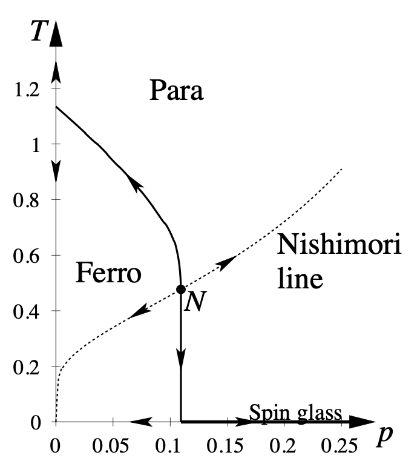

# Monte Carlo Simulation of 2D Random Bond Ising Model
   Originally Created 3/12/2022 Zhaoyi Li
   
   
   
   
   Hamiltonian: $H=J_{ij}\sum_{<i,j>}\sigma_i\sigma_j$  

### Assuming constant coupling$J_{ij}=J$

Thermodynamic variables:
$$\chi\sim\Delta M, C\sim\Delta E$$
Want to compute $\langle E\rangle$, $\langle E^2\rangle$, $\langle M\rangle$, $\langle M^2\rangle$ with thermodynamic average: $$\langle X\rangle = \frac{1}{Z}\sum_{\{\sigma\}}X(\{\sigma\})e^{-\beta H(\{\sigma\})}$$

### Adding randomness in $J_{\langle ij\rangle}$

$P[J_{ij}] = (1-p)\delta(J_{ij}-J)+p\delta(J_{ij}+J)$  

Here $\langle X\rangle = \mathbb{E}[\frac{1}{Z}\sum_{\{\sigma\}}X(\{\sigma\})e^{-\beta H(\{\sigma\})}]$

## Background

$\cdot$ spin glass  

$\cdot$ quantum error correction  

